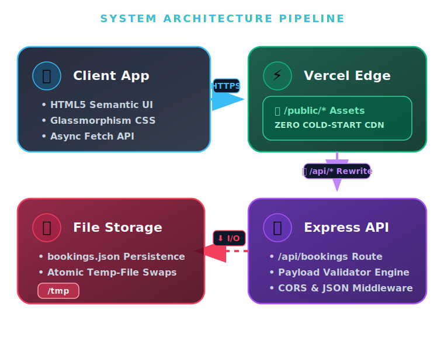
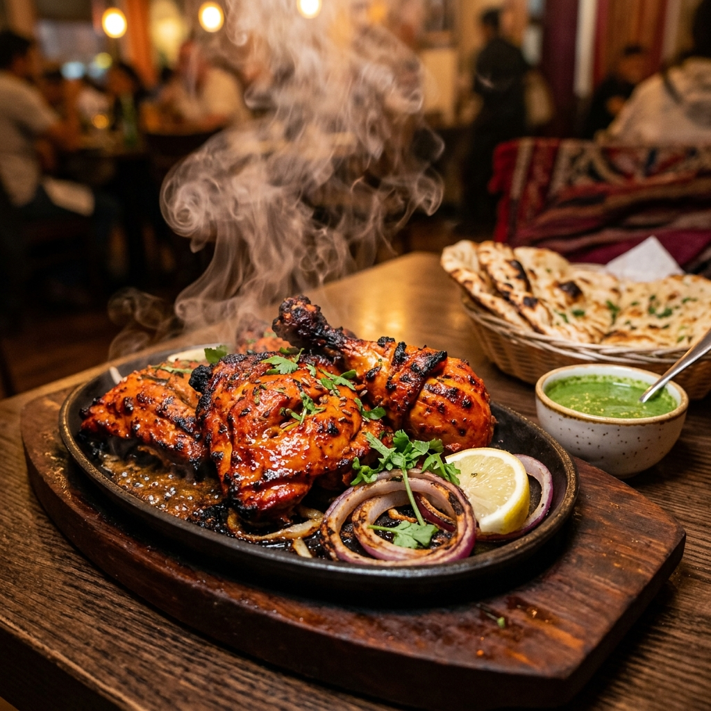
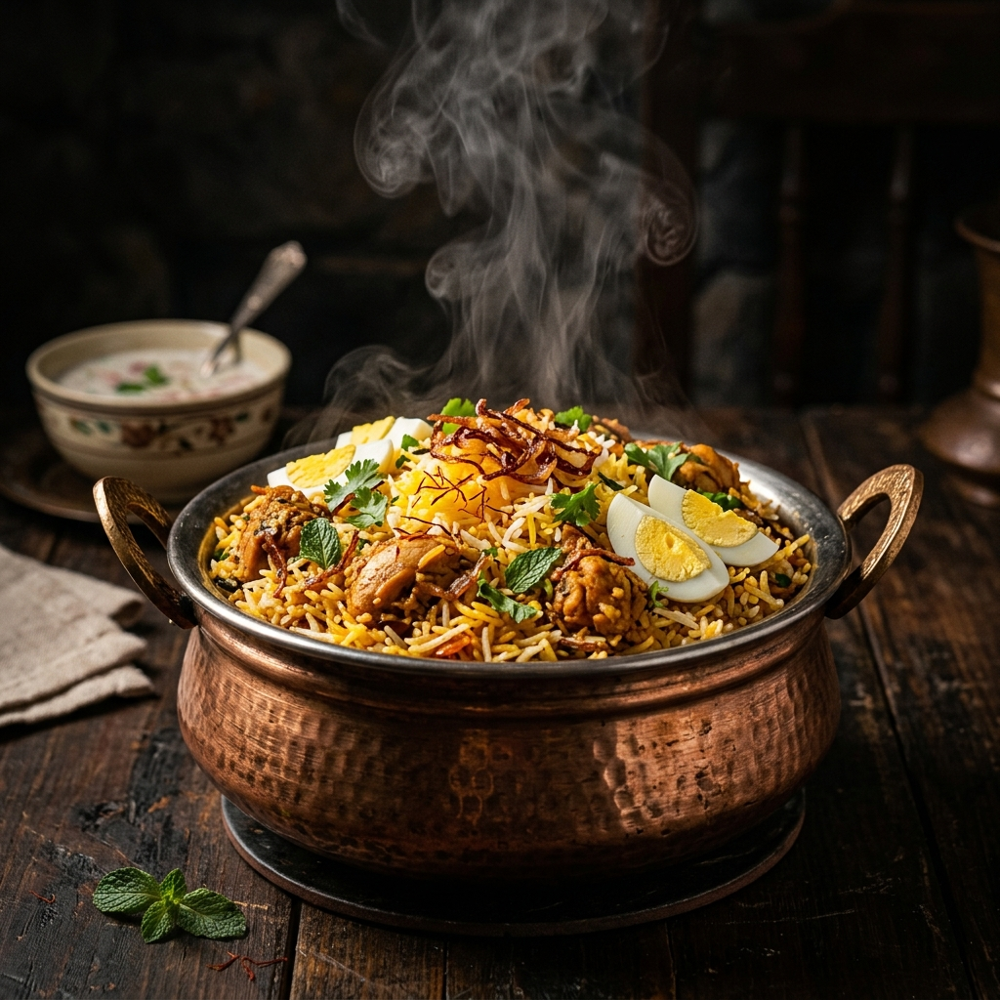
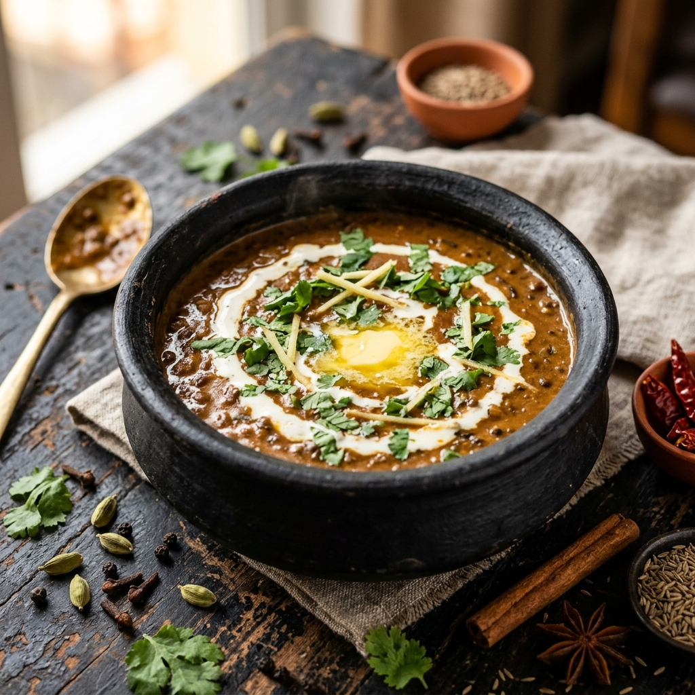

<div align="center">

  

  <br />

  <p><strong>Authentic North Indian Cuisine — Full-Stack Reservation Platform</strong></p>

  <p>
    <a href="#-features"></a>
    <a href="#-tech-stack"></a>
    <a href="#-tech-stack"></a>
    <a href="#-cloud--vercel-deployment"></a>
    <a href="LICENSE"></a>
  </p>

  <p>
    <em>Experience ancestral culinary heritage blended with state-of-the-art web technology.</em>
  </p>

</div>

<hr />

## 📋 Table of Contents

- [📖 Overview](#-overview)
- [✨ Key Features](#-key-features)
- [🛠️ Technical Architecture & Stack](#-technical-architecture--stack)
- [📡 REST API Documentation](#-rest-api-documentation)
- [🚀 Getting Started](#-getting-started)
- [☁️ Cloud Deployment](#-cloud-deployment)
- [📸 Culinary Gallery](#-culinary-gallery)

---

## 📖 Overview

**Raju Dhaba** is a full-stack restaurant reservation web application designed for high performance and mobile-first aesthetics. Built without heavy frameworks, it delivers glassmorphism UI interactions and a robust RESTful API backend configured for instant serverless cloud deployment.

---

## ✨ Key Features

- 🎨 **Dynamic Premium UI**: Responsive glassmorphism styling with smooth scroll animations.
- 📅 **Real-Time Booking Engine**: Instant table reservations with rigorous client/server validation rules.
- 🔧 **Admin Control Portal**: Interactive dashboard (`/admin`) to track live analytics and update reservation states.
- ⚡ **Zero-Cold-Start CDN**: Edge CDN static serving (`/public/*`) combined with serverless backend execution.
- 🔒 **Atomic JSON Storage**: Crash-proof file storage with auto-sensing `/tmp` adaptation for cloud environments.

---

## 🛠️ Technical Architecture & Stack

<div align="center">
  
</div>

### Core Technologies

| Layer | Technologies Used |
| :--- | :--- |
| **Frontend** | HTML5 Semantic Markup, Custom CSS3 Variables & Animations, Vanilla JS Fetch API |
| **Backend** | Node.js Runtime, Express.js REST Framework, CORS Middleware |
| **Database** | Native Node `fs` atomic temporary swaps, Ephemeral cloud `/tmp` fallback |
| **Cloud** | Vercel Serverless Functions (`api/index.js`), Global Edge CDN (`vercel.json`) |

---

## 📡 REST API Documentation

Base Endpoint: `/api/bookings`

| Method | Route | Description | Payload / Params |
| :---: | :--- | :--- | :--- |
| `GET` | `/` | List reservations | `?date=YYYY-MM-DD` |
| `POST` | `/` | Create booking | JSON Reservation Object |
| `GET` | `/stats` | Dashboard metrics | *None* |
| `GET` | `/:id` | Single booking | URL Parameter `id` |
| `PATCH`| `/:id/status`| Update status | `{ "status": "confirmed" }` |
| `DELETE`| `/:id` | Delete booking | URL Parameter `id` |

#### Example POST Request Body
```json
{
  "fname": "Rahul",
  "lname": "Sharma",
  "phone": "+91 98765 43210",
  "date": "2026-07-01",
  "time": "19:30",
  "guests": "4",
  "special": "Corner table preferred."
}
```

---

## 🚀 Getting Started

```bash
# 1. Clonerepository
cd Raju-dhaba

# 2. Install dependencies
npm install

# 3. Start dev server
npm run dev
```

- 🌐 **Customer Website**: [http://localhost:3000](http://localhost:3000)
- 🔧 **Admin Portal**: [http://localhost:3000/admin](http://localhost:3000/admin)

---

## ☁️ Cloud Deployment

Pre-configured for zero-config deployment on **Vercel**:
```bash
npx vercel --prod
```

---

## 📸 Culinary Gallery

<div align="center">
  
  
  
</div>